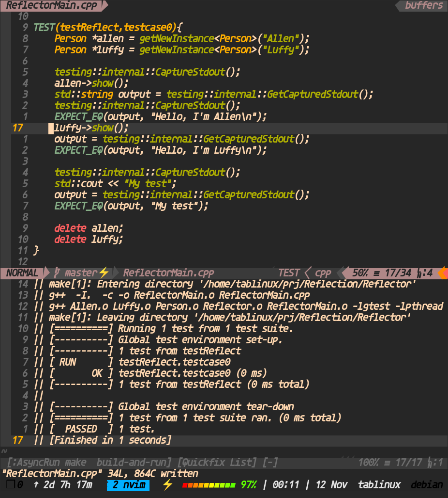

# c++ 反射器实现原理

###### 
```cpp

    //核心数据结构
    map<std::string,ObjectFactory*> objectFactories;

    //根据类名获取对象实例
    ReflectObject* getNewInstance(const std::string);

    //c++ language trick
    //范型编程 
    Reflect##name //预处理器将name和Reflect拼接

    //TODO
    // 全局变量初始化的类没有回收内存
```

<!-- 程序使用 VS2013 编译，你也可以将代码复制出来，使用 g++ 或其它 cpp 编译器编译。 -->


## Suit to my editor


